# Renders

Batch images produced by the `render` workflow (see the main branch).

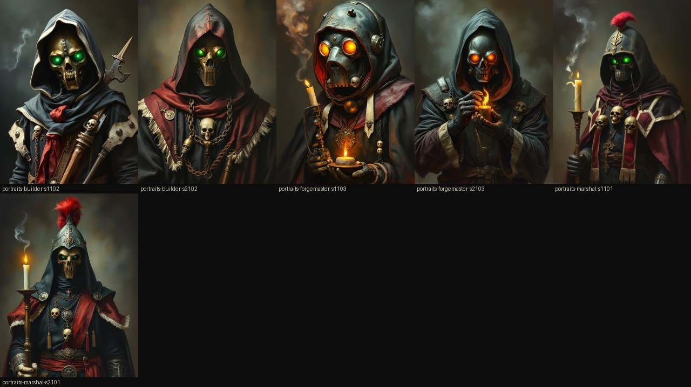

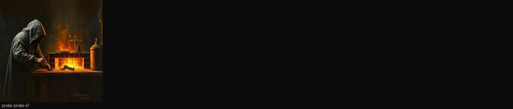

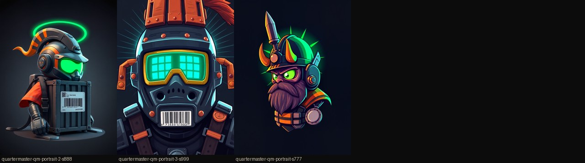

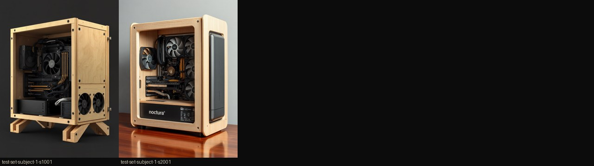

| set | id | seed | time | size | image |
|---|---|---|---|---|---|
| portraits | builder | 1102 | 2863s | [768, 1024] | 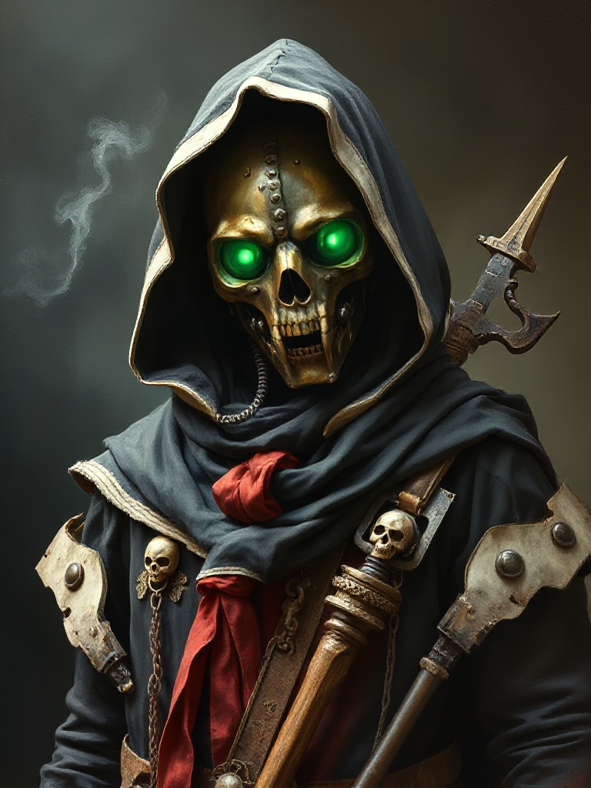 |
| portraits | builder | 2102 | 1632s | [768, 1024] | 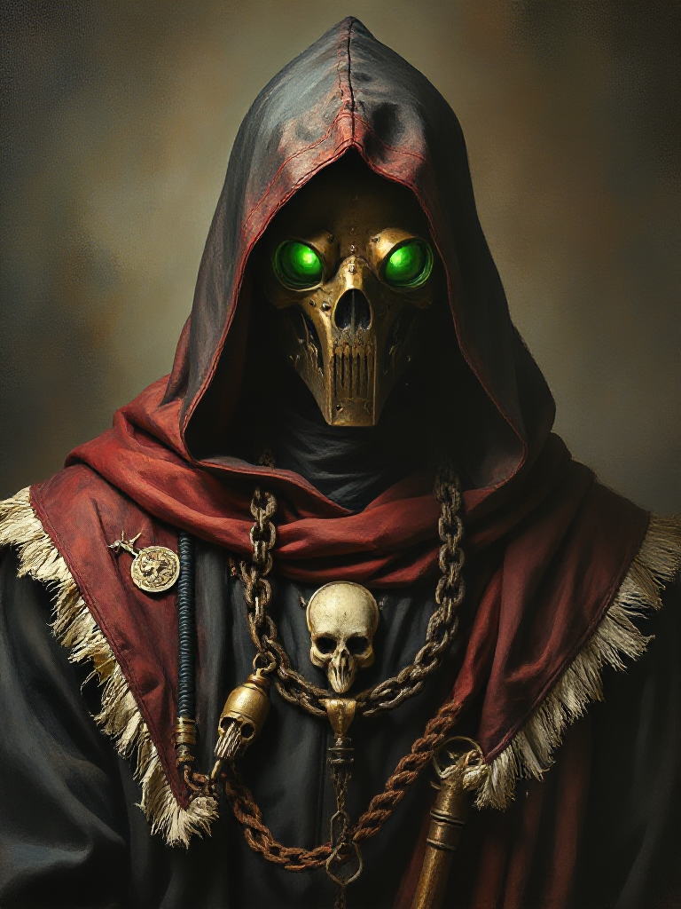 |
| portraits | forgemaster | 1103 | 2688s | [768, 1024] | 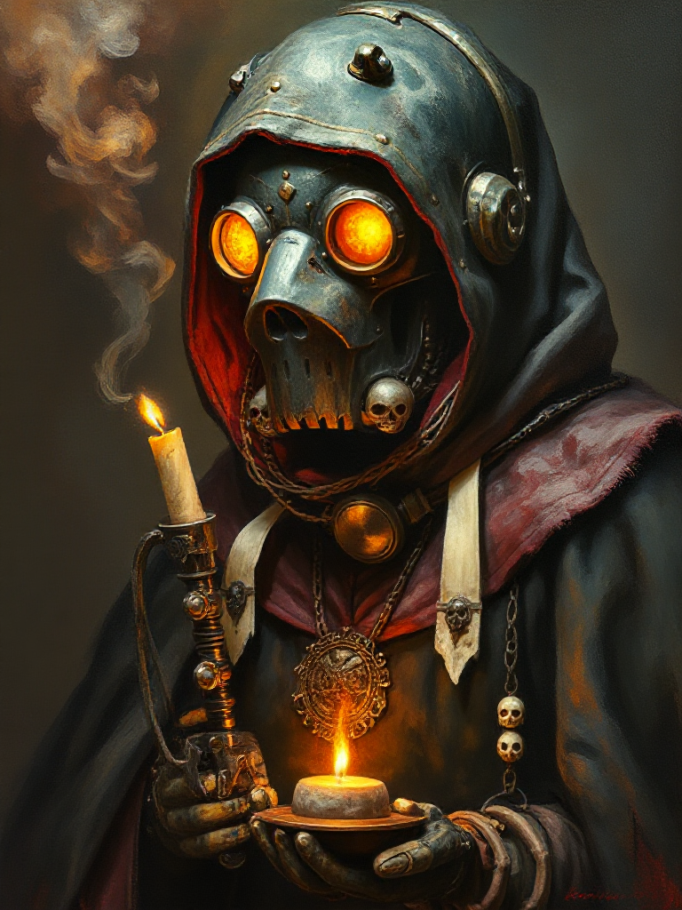 |
| portraits | forgemaster | 2103 | 2705s | [768, 1024] | 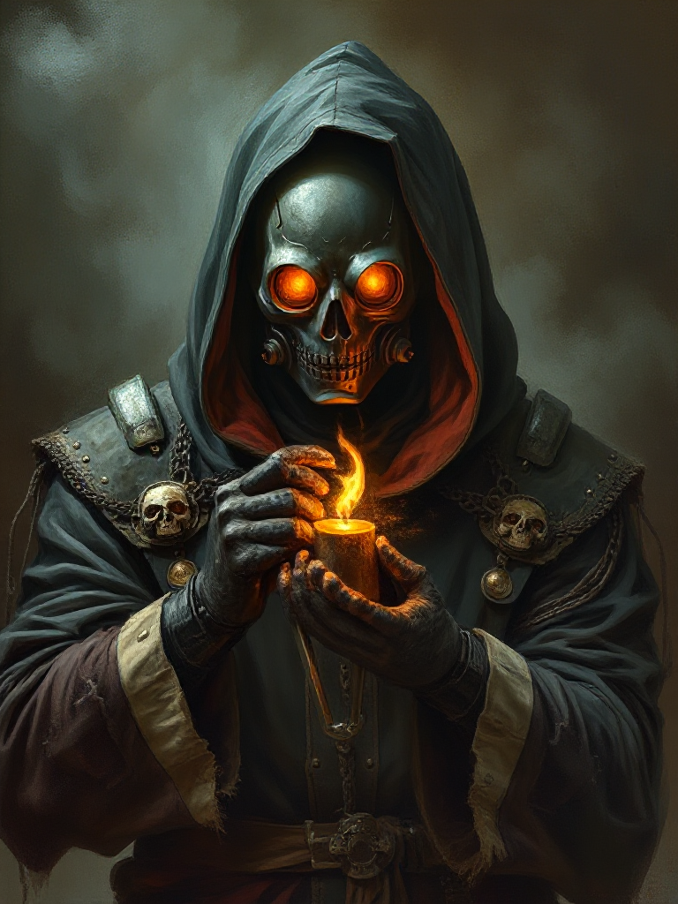 |
| portraits | marshal | 1101 | 2700s | [768, 1024] | 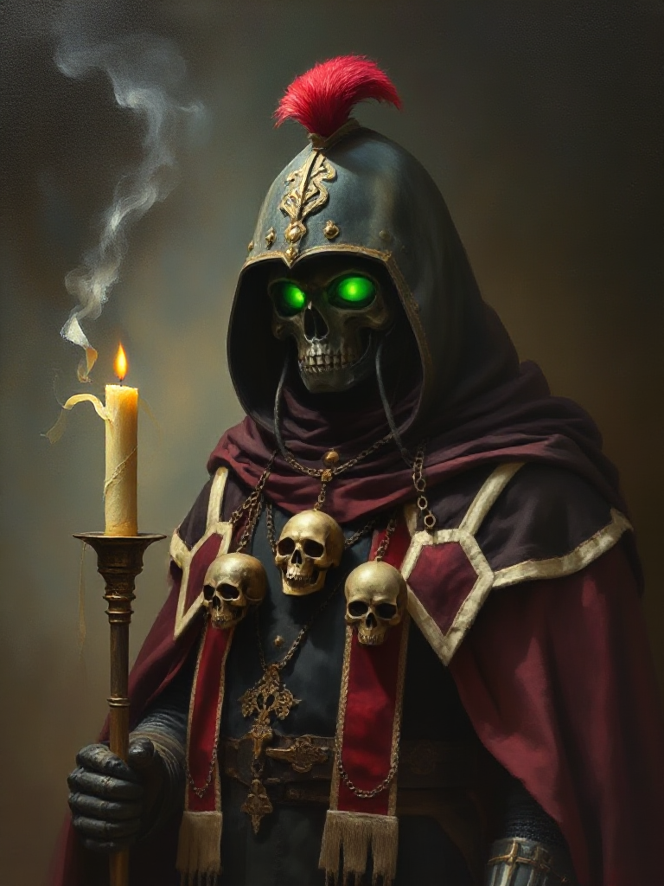 |
| portraits | marshal | 2101 | 1605s | [768, 1024] | 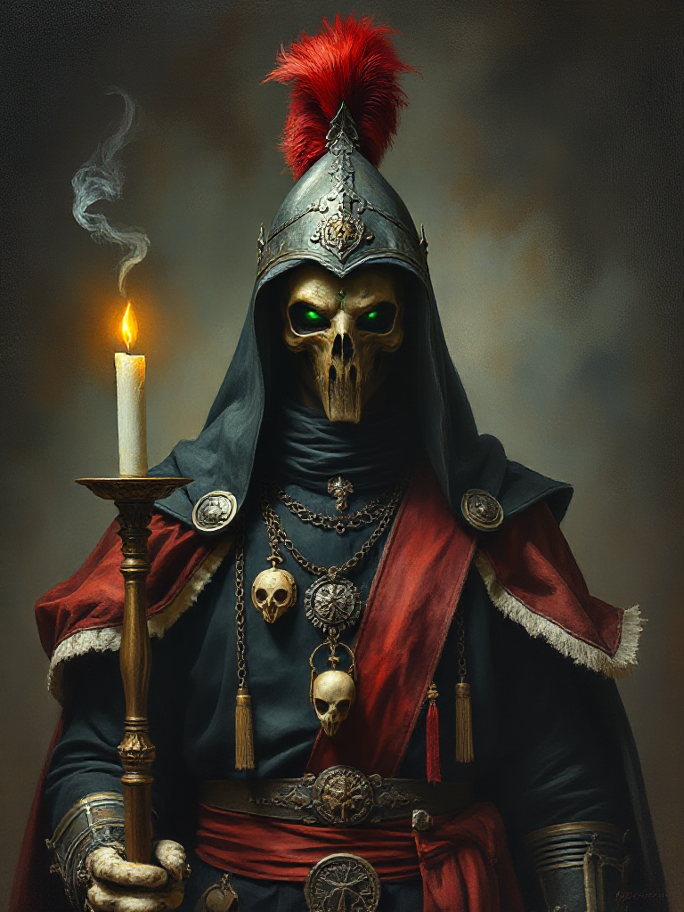 |
| probe | probe | 7 | 422s | [512, 512] | 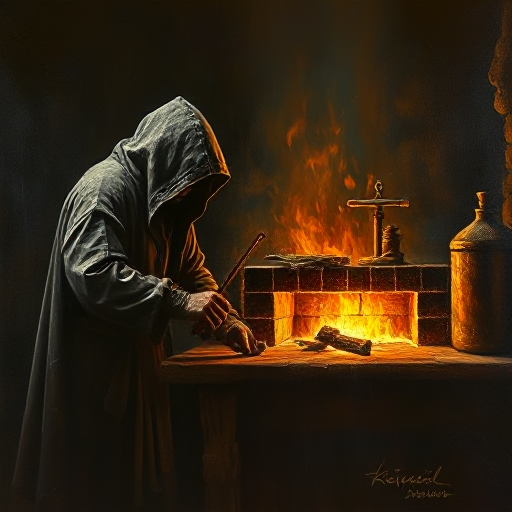 |
| quartermaster | qm-portrait-2 | 888 | 2758s | [768, 1024] | 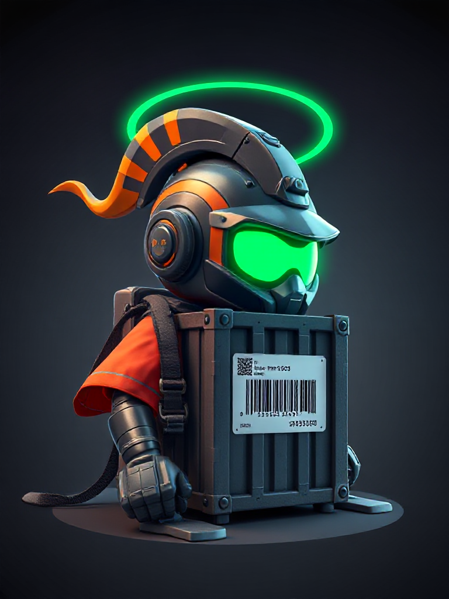 |
| quartermaster | qm-portrait-3 | 999 | 2765s | [768, 1024] | 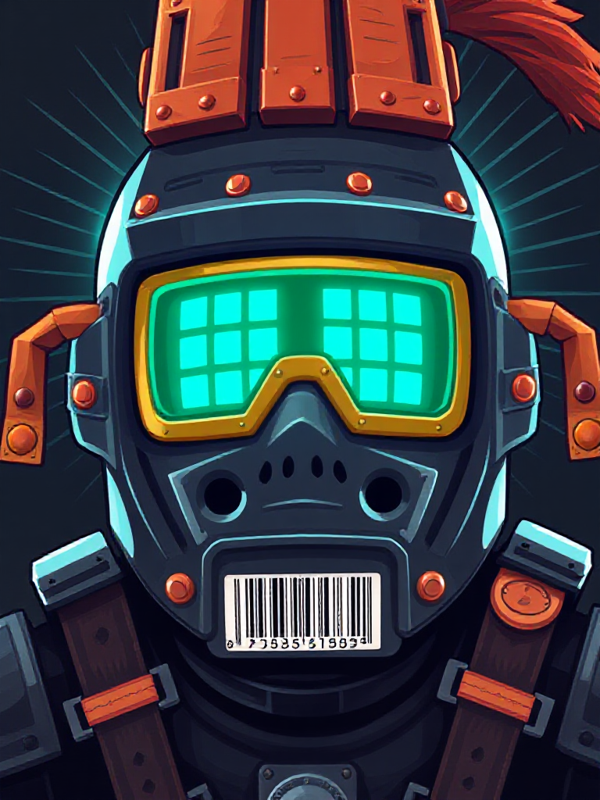 |
| quartermaster | qm-portrait | 777 | 3003s | [768, 1024] |  |
| test-set | subject-1 | 1001 | 2519s | [768, 1024] | 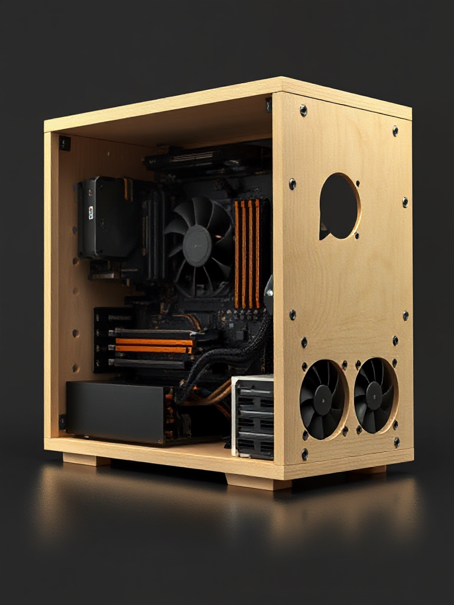 |
| test-set | subject-1 | 2001 | 1481s | [768, 1024] | 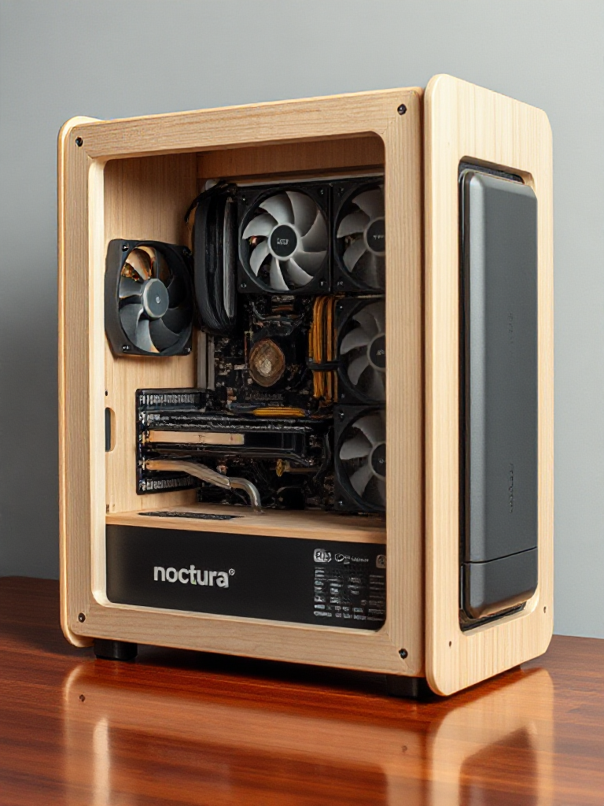 |
